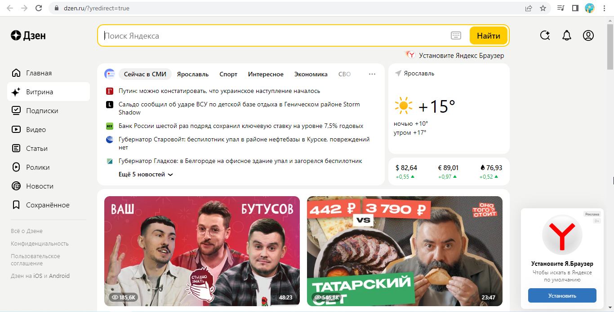
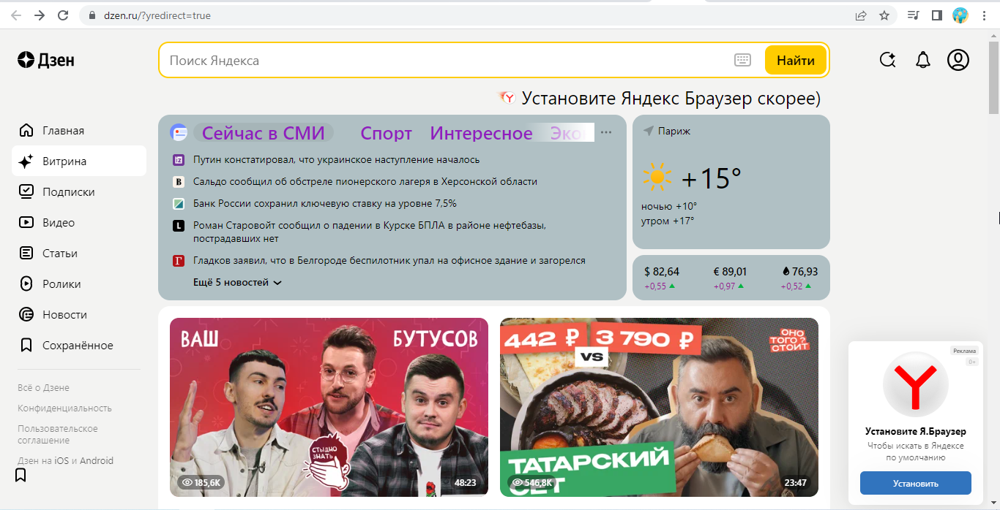

1. Протокол https
2. Структура страницы
   * шапка
   * зона виджетов
   * слева минимальный подвал
   * бесконечная зона контента
3. Изменения 

+ увеличен логотип
+ слева в навигации добавлен значок
+ город в СМИ удален
+ город в погоде переименован
+ изменен размер "сейчас в СМИ"
+ изменен цвет "сейчас в СМИ"
+ изменен цвет фона
+ изменен цвет колебаний валют
+ "установите яндекс браузер скорее"
+ размер шрифта "установите яндекс браузер скорее" увеличен